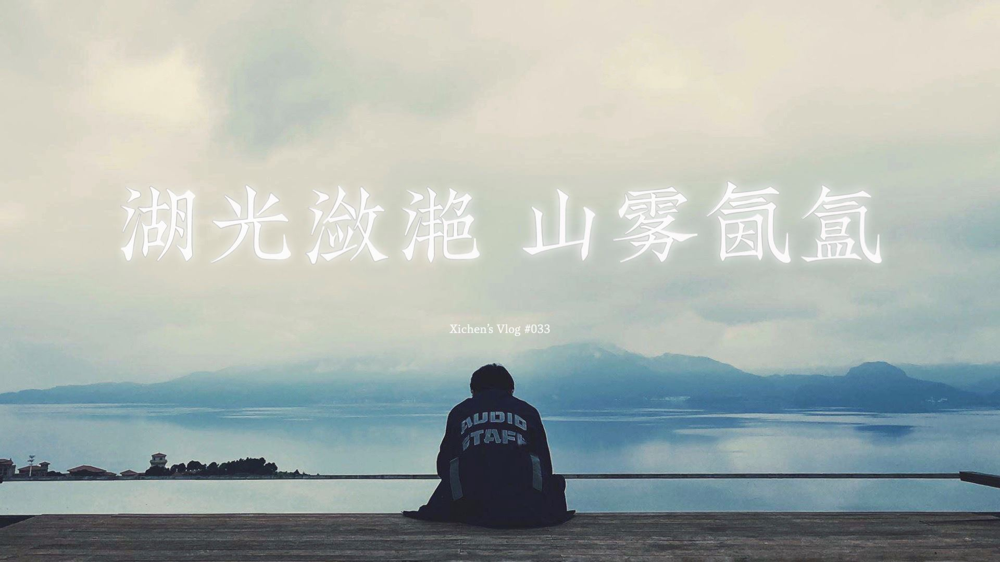
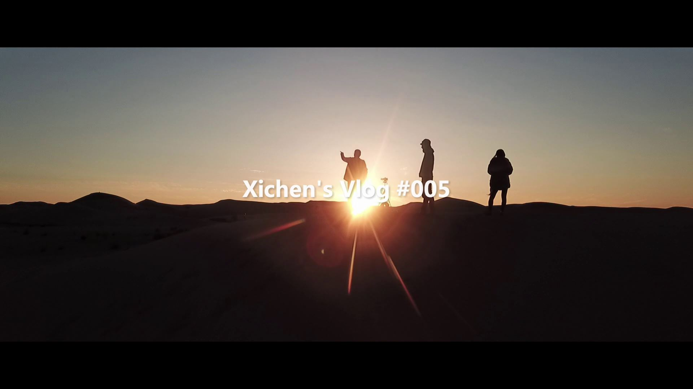

# Xichen's Vlog
## 泛主题的生活影像记录

Website: [SounDoer.com](https://soundoer.com)  
Weibo: [希辰Xichen](https://weibo.com/soundoer)  
Bilibili: [希辰Xichen](https://space.bilibili.com/157914767)  
YouTube: [Xichen Shen](https://www.youtube.com/c/XichenShen)

Font 喜鹊聚珍体 in Video is from [喜鹊造字](https://www.luckytype.com)

---

<!-- Start Document Outline -->

* [Xichen's Vlog #042 浪](#xichens-vlog-042-浪)
* [Xichen's Vlog #041 MIDI Controller DIY](#xichens-vlog-041-midi-controller-diy)
* [Xichen's Vlog #040 “大众”城市探险](#xichens-vlog-040-大众城市探险)
* [Xichen's Vlog #039 道具库房](#xichens-vlog-039-道具库房)
* [Xichen's Vlog #038 Foley with Air](#xichens-vlog-038-foley-with-air)
* [Xichen's Vlog #037 2021 Global Game Jam《剑入禅境》开发纪录](#xichens-vlog-037-2021-global-game-jam剑入禅境开发纪录)
* [Xichen's Vlog #036 我在外滩飞飞机](#xichens-vlog-036-我在外滩飞飞机)
* [Xichen's Vlog #035 徐家渡米轨](#xichens-vlog-035-徐家渡米轨)
* [Xichen's Vlog #034 青龙镇赶集](#xichens-vlog-034-青龙镇赶集)
* [Xichen's Vlog #033 湖光潋滟 山雾氤氲](#xichens-vlog-033-湖光潋滟-山雾氤氲)
* [Xichen's Vlog #032 快乐合成器](#xichens-vlog-032-快乐合成器)
* [Xichen's Vlog #031 东滩月光](#xichens-vlog-031-东滩月光)
* [Xichen's Vlog #030 侯老师开课啦](#xichens-vlog-030-侯老师开课啦)
* [Xichen's Vlog #029 Audio Designer as Game Developer](#xichens-vlog-029-audio-designer-as-game-developer)
* [Xichen's Vlog #028 你从没见过的 WB Studios](#xichens-vlog-028-你从没见过的-wb-studios)
* [Xichen's Vlog #027 突突突突突](#xichens-vlog-027-突突突突突)
* [Xichen's Vlog #026 NExT Game Jam](#xichens-vlog-026-next-game-jam)
* [Xichen's Vlog #025 Jerry.树: 取悦自己](#xichens-vlog-025-jerry树-取悦自己)
* [Xichen's Vlog #024 Foley with Sandpaper, Slime and Fish](#xichens-vlog-024-foley-with-sandpaper-slime-and-fish)
* [Xichen's Vlog #023 中影基地录 Foley](#xichens-vlog-023-中影基地录-foley)
* [Xichen's Vlog #022 去日本看 STING](#xichens-vlog-022-去日本看-sting)
* [Xichen's Vlog #021 我是怎么用 GoPro 拍 Vlog 的](#xichens-vlog-021-我是怎么用-gopro-拍-vlog-的)
* [Xichen's Vlog #020 乌苏录林子](#xichens-vlog-020-乌苏录林子)
* [Xichen's Vlog #019 清凉峰录水](#xichens-vlog-019-清凉峰录水)
* [Xichen's Vlog #018 Field Recording 上山入洞](#xichens-vlog-018-field-recording-上山入洞)
* [Xichen's Vlog #017 长广牛头山](#xichens-vlog-017-长广牛头山)
* [Xichen's Vlog #016 游戏音频设计师需要会编程吗？](#xichens-vlog-016-游戏音频设计师需要会编程吗)
* [Xichen's Vlog #015 SHVFS 声音设计专业 INDUSTRY PANEL](#xichens-vlog-015-shvfs-声音设计专业-industry-panel)
* [Xichen's Vlog #014 我是怎么用手机拍 Vlog 的](#xichens-vlog-014-我是怎么用手机拍-vlog-的)
* [Xichen's Vlog #013 海边录音航拍大片](#xichens-vlog-013-海边录音航拍大片)
* [Xichen's Vlog #012 八点三刻人声乐团](#xichens-vlog-012-八点三刻人声乐团)
* [Xichen's Vlog #011 福建泉州行](#xichens-vlog-011-福建泉州行)
* [Xichen's Vlog #010 Deity V-Mic D3 Pro 测评](#xichens-vlog-010-deity-v-mic-d3-pro-测评)
* [Xichen's Vlog #009 Wwise Tour 上海站](#xichens-vlog-009-wwise-tour-上海站)
* [Xichen's Vlog #008 走马观花国际乐展](#xichens-vlog-008-走马观花国际乐展)
* [Xichen's Vlog #007 稻子熟了](#xichens-vlog-007-稻子熟了)
* [Xichen's Vlog #006 飞了一趟重庆](#xichens-vlog-006-飞了一趟重庆)
* [Xichen's Vlog #005 腾格里沙漠徒步行](#xichens-vlog-005-腾格里沙漠徒步行)
* [Xichen's Vlog #004 枸杞岛录音之行](#xichens-vlog-004-枸杞岛录音之行)
* [Xichen's Vlog #003 黄山徒步行](#xichens-vlog-003-黄山徒步行)
* [Xichen's Vlog #002 一次非严肃的 Field Recording Trip](#xichens-vlog-002-一次非严肃的-field-recording-trip)
* [Xichen's Vlog #001 用什么设备录声音](#xichens-vlog-001-用什么设备录声音)
* [Xichen's Vlog #000 From SounDoer to 希辰](#xichens-vlog-000-from-soundoer-to-希辰)

<!-- End Document Outline -->

---

### Xichen's Vlog #042 浪

[YouTube](https://www.youtube.com/watch?v=4D02QzAS2cI)
[Bilibili](https://www.bilibili.com/video/BV1YQ4y1X7VC)

嵊泗枸杞岛寻浪 Presented by NExT Studios Audio Team。

Recording Microphones:  
Schoeps CCM4 with Parabolic Reflector  
SoundField SPS200

Music in Video is from artlist.io:  
Naos Lullaby by Rafi-b.-Levy

### Xichen's Vlog #041 MIDI Controller DIY

[YouTube](https://www.youtube.com/watch?v=l4rwzVTaA8A)
[Bilibili](https://www.bilibili.com/video/BV1Wh411p7m8)

做了一个花哨无用的东西。

Music in Video is from artlist.io:  
Turn Up by Monako  
More by Nenor

### Xichen's Vlog #040 “大众”城市探险

[YouTube](https://www.youtube.com/watch?v=_GJcpv2FO5w)
[Bilibili](https://www.bilibili.com/video/BV1Sq4y1Z7yA)

上海复兴岛废宅，“大众”城市探险。

Music in Video is from artlist.io:  
Swifts Day by Aquartos

### Xichen's Vlog #039 道具库房

[YouTube](https://www.youtube.com/watch?v=1pO5mkMhckw)
[Bilibili](https://www.bilibili.com/video/BV1Zq4y1T72y)

参观中影基地道具库房，走调的老钢琴独具魅力。

### Xichen's Vlog #038 Foley with Air

[YouTube](https://www.youtube.com/watch?v=1tl_UAWcMfc)
[Bilibili](https://www.bilibili.com/video/BV1bf4y1A72d)

再赴北京怀柔中影基地录拟音。

### Xichen's Vlog #037 2021 Global Game Jam《剑入禅境》开发纪录

[YouTube](https://www.youtube.com/watch?v=tlYmEOBl11g)
[Bilibili](https://www.bilibili.com/video/BV16v411s7i6)

又一次在 Game Jam 活动中与梓涛合作，完成了一部着重声音体验的小作品。

[《剑入禅境》游戏下载链接](https://yezi.itch.io/sz)

Music from Crouching Tiger, Hidden Dragon OST by Tan Dun, Yo-Yo Ma, Xie-yang Chen, David Cossin

### Xichen's Vlog #036 我在外滩飞飞机

Xichen's Vlog #036 My Drone Flying above The Bund

[YouTube](https://www.youtube.com/watch?v=AzDUX9r7Ejc)
[Bilibili](https://www.bilibili.com/video/BV1oK4y1j72V)

2020年6月8日，友情参与拍摄项目，带着我的小飞机俯瞰难得一见的外滩夜景。

Music in Video:  
罗威 - 延安高架桥小夜曲

### Xichen's Vlog #035 徐家渡米轨

Xichen's Vlog #035 Abandoned Metre-Gauge Railways in Xujiadu, Yunnan

[YouTube](https://www.youtube.com/watch?v=PaYudIfVo1I)
[Bilibili](https://www.bilibili.com/video/bv1iK4y1h7Sa)

南盘江边的徐家渡乡有一段米轨铁路。

1910年4月，滇越铁路全线建成通车，连接中国昆明和越南海防港，  
全长859公里，使用轨距为一米的窄轨铁路，又称“米轨铁路”，  
是中国西南地区的第一条铁路，也是中国第一条通车的国际铁路。  
据村民介绍，徐家渡站已于一年多前彻底停运，  
之后可能会被改造成观光小火车路线。

Music in Video:  
莫西子诗 - 山魈

### Xichen's Vlog #034 青龙镇赶集

Xichen's Vlog #034 Rural Fair in Qinglong Town, Yunnan

[YouTube](https://www.youtube.com/watch?v=xkdf7FnKPpI)
[Bilibili](https://www.bilibili.com/video/BV145411j7KE)

在云南省玉溪市华宁县青龙镇的集市上，我见到了很多从没见过和许久未见的东西。

Music in Video:  
莫西子诗 - 赶集

### Xichen's Vlog #033 湖光潋滟 山雾氤氲

Xichen's Vlog #033 Yunnan Fuxian Lake

[YouTube](https://www.youtube.com/watch?v=fUuDUrfdj1Y)
[Bilibili](https://www.bilibili.com/video/BV1HK4y1h7F5)

抚仙湖云海山居的169秒钟。

抚仙湖方寸间云海山居民宿  
地址：云南澄江右所镇小湾村102号

Music in Video is from artlist.io:  
Cautious Fog by Harbor Fate

### Xichen's Vlog #032 快乐合成器

[YouTube](https://www.youtube.com/watch?v=ov-9Wer4KCc)
[Bilibili](https://www.bilibili.com/video/BV16h411X7u7)

两位好友侯晨钟与叶梓涛的梦幻联动，关于合成器话题的有意思的对谈。

Music in Video is from artlist.io:  
Normalize by Stanley Gurvich

### Xichen's Vlog #031 东滩月光

Xichen's Vlog #031 Moonlight on Dongtan, Shanghai

[YouTube](https://www.youtube.com/watch?v=6liCwO19ZFY)
[Bilibili](https://www.bilibili.com/video/BV1Qa4y1L7TC)

在一个柔软的夜晚，留下我属于都市的身体  
抬起手，是星云在燃烧  
背靠地球，我拨动以太的帷幕  
向黑暗的宇宙探出一束微亮  
而你，光年外的爱人，要如何才能轻抚我的脸庞  
——耿子骏

Music in Video:  
康姆士乐团 - 你要如何，我们就如何

### Xichen's Vlog #030 侯老师开课啦

[YouTube](https://www.youtube.com/watch?v=ufFtdt9wKek)
[Bilibili](https://www.bilibili.com/video/bv1DT4y1j7qJ)

Audiokinetic 产品专家侯晨钟线下技术分享，巧遇学弟交流入行经验。

Music in Video is from artlist.io:  
Grumpy Snowflake by Peter Spacey

### Xichen's Vlog #029 Audio Designer as Game Developer

[YouTube](https://www.youtube.com/watch?v=WIe9NFA_ZRA)
[Bilibili](https://www.bilibili.com/video/BV1Za4y1i7Rd)

把自己先定位成游戏开发者，这样你就知道做一名游戏音频设计师需要具备哪些基本技能了。侯老师分享个人学习方法，助你快速入行游戏音频设计。

Music in Video is from artlist.io:  
Better Now Instrumental Version by These Nuts

### Xichen's Vlog #028 你从没见过的 WB Studios

Xichen's Vlog #028 A Special Warner Bros. Studio Tour

[YouTube](https://www.youtube.com/watch?v=PRqeI3vFDo0)
[Bilibili](https://www.bilibili.com/video/BV1P54y1R73e)

希辰带你参观华纳影城里深藏地下的录音室和拟音棚。

Mr. Longbottom Flies from Harry Potter and the Philosopher's Stone OST by John Williams  

Music in Video is from artlist.io:  
Endless Fields Pizzica to Version by Ian Post  
Beams by AM Beef  
Busy World by Lance Conrad  
Diamond by The Delorean

### Xichen's Vlog #027 突突突突突

[YouTube](https://www.youtube.com/watch?v=P0d5BbLGoxA)
[Bilibili](https://www.bilibili.com/video/av93662654)

NExT Studios Audio Team 远赴美国洛杉矶完成了一次 Gun Recording Session。

THANKS  
[Bryan Watkins](https://www.imdb.com/name/nm0914265)  
Game Sound Supervisor at Warner Bros.  
[John Fasal](https://www.imdb.com/name/nm0268635)  
Legendary Recordist  
[ISS](https://issprops.com)  
Independent Studio Services  
Larry, Tim & Steve

Music in Video is from artlist.io:  
Overdrive by Anton Vlasov  
Punch by Oliver Michael  
Bionic Games by Ian Post  
Do the Math by SLPSTRM

### Xichen's Vlog #026 NExT Game Jam

[YouTube](https://www.youtube.com/watch?v=yDq4LN-Dubw)
[Bilibili](https://www.bilibili.com/video/av80837219)

NExT Studios 48小时 Game Jam 全纪录，以及与知乎大V叶梓涛的深入长谈。

[《C(8,3)》游戏下载链接](https://yezi.itch.io/c38)

Music in Video is from BimBamBoom:  
Rainbow High  
Bright Up  
Soul Makossa  
Tokyo Aventure

### Xichen's Vlog #025 Jerry.树: 取悦自己

[YouTube](https://www.youtube.com/watch?v=aYcr9OGJfDM)
[Bilibili](https://www.bilibili.com/video/av80414866)

Jerry 说带我感受摇滚乐的魅力，Jerry 还说要取悦自己。2019年11月22日，法兹乐队全国巡演，上海育音堂。

Music in Video is from 法兹乐队:  
临兵斗者  
控制

### Xichen's Vlog #024 Foley with Sandpaper, Slime and Fish

[YouTube](https://www.youtube.com/watch?v=X9AdLHDRKGw)
[Bilibili](https://www.bilibili.com/video/av77526311)

为了设计某种怪物皮肤材质的声音，我们去 SoundMachine Studio 进行了一次拟音试验，探索了更多的可能性。

Music in Video is from BimBamBoom:  
King & Joker

### Xichen's Vlog #023 中影基地录 Foley

Xichen's Vlog #023 Foley at State Production Base of China Film Group

[YouTube](https://www.youtube.com/watch?v=MhqYJk3bvec)
[Bilibili](https://www.bilibili.com/video/av76029861)

NExT 快递员千里送话筒，幕后探秘中影基地拟音棚。

Music in Video is from John Wick (Original Motion Picture Soundtrack):  
Tyler Bates & Joel J. Richard - On The Hunt  
The Candy Shop Boys - Evil Man Blues

### Xichen's Vlog #022 去日本看 STING

[YouTube](https://www.youtube.com/watch?v=byYNBNPLJp4)
[Bilibili](https://www.bilibili.com/video/av75122416)

NExT Studios Audio Team 赴日观看 STING 演唱会，交流考察日本音乐工作室。遭遇超强台风海贝思，行程受阻差点回不来。

Music in Video is from STING:  
Brand New Day  
Englishman In New York

### Xichen's Vlog #021 我是怎么用 GoPro 拍 Vlog 的

[YouTube](https://www.youtube.com/watch?v=HWN2qGKf31s)
[Bilibili](https://www.bilibili.com/video/av66316226)

简单的外设装备与基础的机内设置，轻松使用 GoPro 拍摄小视频。

Equipments:  
Manfrotto PIXI EVO  
Peak Design Leash Camera Strap  
Telesin GoPro Hero7 Cage  
DIZA ND2-400 Filter 52mm

Music in Video is from artlist.io:  
Phonebroke by Fresh

### Xichen's Vlog #020 乌苏录林子

Xichen's Vlog #020 Field Recording: Coniferous Forest Sound in Xinjiang China

[YouTube](https://www.youtube.com/watch?v=47z_jKrkdJY)
[Bilibili](https://www.bilibili.com/video/av66256999)

远赴新疆乌苏，三上佛山录林子。山路偶遇哈族老爷子，自弹自唱精彩绝伦。

Field Recording Eqiups:  
Sound Devices 744  
Sound Devices MixPre-6  
Schoeps CMC641  
Neumann KM145

Music in Video is from artlist.io:  
Portal by Oliver Michael  
Midnight Mermaids by James Forest  
Show Out by Theevs

小时候在大家一起打闹玩耍  
也会帮助长辈们打草  
得到他们的赞美  
小时候去偷邻居家的杏子  
被老头老太太发现  
挨了他们的打  
时间如白驹过隙  
你看这些美丽的河山  
谁能真正珍惜童年呢  
By 萨克部落

### Xichen's Vlog #019 清凉峰录水

Xichen's Vlog #019 Field Recording: Water Sound in Mountains

[YouTube](https://www.youtube.com/watch?v=K6uWAv9lURM)
[Bilibili](https://www.bilibili.com/video/av56849952)

与杨杰老师、子骏一起奔赴清凉峰，现场讲解如何录水。

Field Recording Eqiups:  
Sound Devices 744  
Sound Devices MixPre-6  
Schoeps CMC641 Set  
3Dio Free Space Pro  
Hydrophone  
Sony PCM-D10  
Zoom H6

杭州临安独居一舍度假民宿  
地址：临安市清凉峰镇马啸乡浙川村银龙坞1号

Music in Video is from artlist.io:  
Brightness by Lane King  
Possible Light by Ziv Moran

### Xichen's Vlog #018 Field Recording 上山入洞

Xichen's Vlog #018 Field Recording: Up to Hill, Down to Cave.

[YouTube](https://www.youtube.com/watch?v=DaO_awlh7p8)
[Bilibili](https://www.bilibili.com/video/av53560078)

与杨杰老师、阿耿一起上山入洞录制野外声音，方山乌龙古道、长兴煤山镇洞山、湖州黄龙洞。视频内有录音片段试听。

Field Recording Eqiups:  
Sound Devices 744  
Sound Devices MixPre-6  
Schoeps CMC641 Set  
3Dio Free Space Pro  
Hydrophone  
Contact Microphone  
Sony PCM-D10  
Sennheiser HD 25

Music in Video is from artlist.io:  
The Bridge by Ziv Moran  
Giving It All by Be Still the Earth

### Xichen's Vlog #017 长广牛头山

[YouTube](https://www.youtube.com/watch?v=l0mmGSShtkQ)
[Bilibili](https://www.bilibili.com/video/BV1nb41157yw)

长兴一霸阿木哥带你逛切尔牛贝利。

Music in Vlog is from artlist.io:  
Incident by Alex Zado (Colloquium)  
Revelations by Tristan Barton (Revelations)  
Holding Back by Michael FK (Embers)

### Xichen's Vlog #016 游戏音频设计师需要会编程吗？

[YouTube](https://www.youtube.com/watch?v=ptcft3HHxuY)
[Bilibili](https://www.bilibili.com/video/BV1Wb411E7uC)

多年网友终得见，与游戏声音设计师胡磊聊一聊几个大家关心的游戏音频从业问题。

Music in Vlog is from artlist.io:  
Celebrate Your Heart by Maytal Michaeli (Celebrate Your Heart)

### Xichen's Vlog #015 SHVFS 声音设计专业 INDUSTRY PANEL

[YouTube](https://www.youtube.com/watch?v=eCQGv5dF-1E)
[Bilibili](https://www.bilibili.com/video/BV1Gb411b7Lz)

听 Jeremy 老师介绍什么是 Industry Panel。

Music in Vlog is from artlist.io:  
Glossy by Skygaze (LUSH)  
Through the Fire by Michael Shynes (Simply)

### Xichen's Vlog #014 我是怎么用手机拍 Vlog 的

[YouTube](https://www.youtube.com/watch?v=vTfSCcXA_Cg)
[Bilibili](https://www.bilibili.com/video/BV11b411t7Mm)

介绍一下我用手机拍摄 Vlog 的设置和配件。

Music in Vlog is from artlist.io:  
Sunbeam by Onyx Music (Exploring Time)  
By My Side by K. Solis

### Xichen's Vlog #013 海边录音航拍大片

[YouTube](https://www.youtube.com/watch?v=1u45bHwRDZU)
[Bilibili](https://www.bilibili.com/video/BV1nt411s78s)

拍摄了一期纪录片节目，过段时间大家可以在上海地铁的屏幕上看到我了。

### Xichen's Vlog #012 八点三刻人声乐团

[YouTube](https://www.youtube.com/watch?v=vGtvXadxBDI)
[Bilibili](https://www.bilibili.com/video/BV1at411r7ZU)

送上一首 Santa Claus is Coming to Town，祝大家圣诞快乐！

### Xichen's Vlog #011 福建泉州行

[YouTube](https://www.youtube.com/watch?v=ZqQQahIvAmw)
[Bilibili](https://www.bilibili.com/video/BV1Yt411r7cs)

吃喝玩乐游三天，以及拍了半年 Vlog 之后的三点感想。

### Xichen's Vlog #010 Deity V-Mic D3 Pro 测评

[YouTube](https://www.youtube.com/watch?v=Q6K6ibOP8uY)
[Bilibili](https://www.bilibili.com/video/BV1Yt411r7aQ)

介绍一下新品牌 Deity 的新产品 V-Mic D3 Pro，一款小巧轻便的 On-Camera 麦克风。

### Xichen's Vlog #009 Wwise Tour 上海站

[YouTube](https://www.youtube.com/watch?v=0KGJlBX0WmY)
[Bilibili](https://www.bilibili.com/video/BV1Yt411r7bs)

国内游戏音频圈同行齐聚，新老朋友线下聚会。

### Xichen's Vlog #008 走马观花国际乐展

[YouTube](https://www.youtube.com/watch?v=7qTj6vV0FO0)
[Bilibili](https://www.bilibili.com/video/BV1Yt411r7nq)

与杨杰老师和汤楠老板一起聊了“游戏声音设计趣事谈”，欢迎网友们时常联系，线下面基。

### Xichen's Vlog #007 稻子熟了

[YouTube](https://www.youtube.com/watch?v=A-ycWHz7gK0)
[Bilibili](https://www.bilibili.com/video/BV1Yt411r7pe)

国庆假期回湖州，记录一下农村老家，可能几年之后一拆迁就没了。

### Xichen's Vlog #006 飞了一趟重庆

[YouTube](https://www.youtube.com/watch?v=VKSAwK3vguY)
[Bilibili](https://www.bilibili.com/video/BV1Yt411r7jb)

国庆节前接了一个录音小活，顺道介绍一下拍摄采访项目的同期录音需要准备哪些设备；试着给片子调了色，新东西学起来。

### Xichen's Vlog #005 腾格里沙漠徒步行

[YouTube](https://www.youtube.com/watch?v=prLOUwkSqmY)
[Bilibili](https://www.bilibili.com/video/BV1Yt411r77N)

沙漠环境听起来是什么感觉？沙漠里有没有昆虫的叫声？无人机正式首飞。

### Xichen's Vlog #004 枸杞岛录音之行

[YouTube](https://www.youtube.com/watch?v=HW36_goK7D4)
[Bilibili](https://www.bilibili.com/video/BV1Yt411r7UJ)

夜晚的海浪声很好听。关于 Field Recording 的几点想法：熟悉设备，Record List，声压计，多走多看多听。

### Xichen's Vlog #003 黄山徒步行

[YouTube](https://www.youtube.com/watch?v=YZjncPMuZIM)
[Bilibili](https://www.bilibili.com/video/BV1Yt411r7De)

天气恶劣，啥都看不到。

### Xichen's Vlog #002 一次非严肃的 Field Recording Trip

[YouTube](https://www.youtube.com/watch?v=o0qohtKzXHA)
[Bilibili](https://www.bilibili.com/video/BV1Yt411r7zW)

浙江温州永嘉县四海山森林公园，山里没人，有蛇有牛。

### Xichen's Vlog #001 用什么设备录声音

[YouTube](https://www.youtube.com/watch?v=g_dcNFp1xzU)
[Bilibili](https://www.bilibili.com/video/BV1Yt411r7B8)

手机、声卡、录音机？挑个贵的就行了。

### Xichen's Vlog #000 From SounDoer to 希辰

[YouTube](https://www.youtube.com/watch?v=YPNFKwR6OGc)
[Bilibili](https://www.bilibili.com/video/BV1ht411r7k5)

希辰是谁？为什么改名了？为什么拍 Vlog？

---